# Pneuma

## 📄 Repository Description

This repository contains the Infrastructure as Code (IaC) that shapes the Pneuma domain — the breathing, dynamic layer of the platform where structure comes alive. In the wider hierarchy of the Platform Team, Pneuma serves as the stratum where Corpus projects and networking become animated workload environments capable of receiving and running application teams.

Here, Kubernetes clusters are called into being across multiple zones; certificate management, service mesh, and policy enforcement are woven into each cluster; and Datadog observability extends its reach into the runtime so the platform can perceive and regulate itself at the application layer.

The Pneuma layer is where infrastructure breathes — where the static order established by Logos and the tangible form given by Corpus are joined by living workloads, dynamic routing, and continuous delivery. It is the atmosphere within which application teams move, build, and ship.

The infrastructure automates the creation of:

- **GKE Clusters** deployed across multiple zones for high availability and geographic redundancy
- **Certificate Management** with cert-manager and Istio CSR for mTLS and workload identity
- **Service Mesh** with Istio for traffic management, observability, and secure service-to-service communication
- **Datadog Integration** with cluster-level monitoring, APM, and infrastructure visibility
- **Policy Enforcement** with OPA Gatekeeper for admission control and governance
- **Namespace Onboarding** with workload identity setup for application teams

This establishes the Kubernetes runtime layer, providing a consistent, secure, and observable environment for all application workloads running on the platform.

## 🏭 Platform Information

- Documentation: [docs.osinfra.io](https://docs.osinfra.io/product-guides/google-cloud-platform/pneuma)
- Service Interfaces: [github.com](https://github.com/osinfra-io/pt-pneuma/issues/new/choose)

##  Development

Our focus is on the core fundamental practice of platform engineering, Infrastructure as Code.

>Open Source Infrastructure (as Code) is a development model for infrastructure that focuses on open collaboration and applying relative lessons learned from software development practices that organizations can use internally at scale. - [Open Source Infrastructure (as Code)](https://www.osinfra.io)

To avoid slowing down stream-aligned teams, we want to open up the possibility for contributions. The Open Source Infrastructure (as Code) model allows team members external to the platform team to contribute with only a slight increase in cognitive load. This section is for developers who want to contribute to this repository, describing the tools used, the skills, and the knowledge required, along with OpenTofu documentation.

See the [documentation](https://docs.osinfra.io/fundamentals/development-setup) for setting up a development environment.

### 🛠️ Tools

- [pre-commit](https://github.com/pre-commit/pre-commit)
- [osinfra-pre-commit-hooks](https://github.com/osinfra-io/pre-commit-hooks)

### 📋 Skills and Knowledge

Links to documentation and other resources required to develop and iterate in this repository successfully.

- [cert-manager](https://cert-manager.io/docs/)
- [datadog kubernetes monitoring](https://docs.datadoghq.com/containers/kubernetes/)
- [google kubernetes engine](https://cloud.google.com/kubernetes-engine/docs)
- [istio service mesh](https://istio.io/latest/docs/)
- [kubernetes](https://kubernetes.io/docs/home/)
- [opa gatekeeper](https://open-policy-agent.github.io/gatekeeper/website/docs/)

## Architecture

**Main Deployment** (`main.tofu`):

- Reads existing Google Cloud project created by pt-corpus via data sources
- Creates the main GKE cluster via the `kubernetes_engine` module
- Installs cert-manager for certificate management
- Installs Istio service mesh for traffic management and observability
- Consumes team and folder data from pt-logos via helpers module
- Uses GitHub Actions infrastructure (service accounts, workload identity, state storage) from pt-corpus

**Shared Configuration** (`shared/`):

- Contains canonical backend and provider configurations symlinked into every workspace directory (root, `regional/`, and all nested subdirectories). See `shared/README.md` for how to add new workspace directories.

**Regional Deployment** (`regional/`):

- Creates GKE clusters in zones across multiple regions (us-east1-b, us-east4-b active; us-east1-c, us-east1-d, us-east4-a, us-east4-c commented out pending cluster provisioning)
- Consumes project information from pt-pneuma main workspace via remote state
- Consumes networking (VPC, subnets) from pt-corpus projects
- Aggregates GKE cluster configurations from all teams via pt-logos

**Regional Subdirectories** (deployed after cluster creation):

- `cert-manager/` - Certificate management using cert-manager
  - `cert-manager/istio-csr/` - Istio CSR integration for mTLS certificate issuance
- `datadog/` - Datadog operator for cluster monitoring and APM
  - `datadog/manifests/` - Datadog Kubernetes manifests and configuration
- `istio/` - Service mesh with Istio for traffic management and observability
  - `istio/manifests/` - Istio configuration manifests
  - `istio/test/` - Istio connectivity tests run after mesh deployment
- `onboarding/` - Namespace and workload identity onboarding for applications
- `opa-gatekeeper/` - Policy enforcement using Open Policy Agent Gatekeeper

## GitHub Actions Workflow

```mermaid
graph LR
    B[Main]

    B --> C1[Regional:<br/>us-east1-b]
    B --> C2[Regional:<br/>us-east4-b]

    C1 --> D1[Onboarding]
    C2 --> D2[Onboarding]

    D1 --> E1[cert-manager]
    D2 --> E2[cert-manager]

    E1 --> F1[cert-manager<br/>Istio CSR]
    E2 --> F2[cert-manager<br/>Istio CSR]

    F1 --> G1[Datadog]
    F2 --> G2[Datadog]

    G1 --> H1[Datadog<br/>Manifests]
    G2 --> H2[Datadog<br/>Manifests]

    H1 --> I1[Istio<br/>Manifests]
    H2 --> I2[Istio<br/>Manifests]

    I1 --> J1[Istio Test]
    I2 --> J2[Istio Test]

    J1 --> K1[Istio]
    J2 --> K2[Istio]

    K1 --> L1[OPA<br/>Gatekeeper]
    K2 --> L2[OPA<br/>Gatekeeper]

    style B fill:#fff4e6,color:#000
    style C1 fill:#d4edda,color:#000
    style C2 fill:#d4edda,color:#000
    style D1 fill:#e6d9f5,color:#000
    style D2 fill:#e6d9f5,color:#000
    style E1 fill:#d1ecf1,color:#000
    style E2 fill:#d1ecf1,color:#000
    style F1 fill:#d1ecf1,color:#000
    style F2 fill:#d1ecf1,color:#000
    style G1 fill:#fff3cd,color:#000
    style G2 fill:#fff3cd,color:#000
    style H1 fill:#fff3cd,color:#000
    style H2 fill:#fff3cd,color:#000
    style I1 fill:#f8d7e5,color:#000
    style I2 fill:#f8d7e5,color:#000
    style J1 fill:#f8d7e5,color:#000
    style J2 fill:#f8d7e5,color:#000
    style K1 fill:#f8d7e5,color:#000
    style K2 fill:#f8d7e5,color:#000
    style L1 fill:#ffdab9,color:#000
    style L2 fill:#ffdab9,color:#000
```

**Workflow Details:**

- **Three Workflows**: Sandbox, Non-Production, Production (identical job structure) plus Sandbox Destroy (manual teardown)
- **Active Zones**: us-east1-b, us-east4-b (us-east1-c, us-east1-d, us-east4-a, us-east4-c commented out pending cluster provisioning)
- **Job Chain per Zone** (10 jobs): Regional → Onboarding → cert-manager → cert-manager Istio CSR → Datadog → Datadog Manifests → Istio Manifests → Istio Test → Istio → OPA Gatekeeper
- **Triggers**:
  - Sandbox: Pull request (opened, synchronize), excluding .md files; manual dispatch
  - Non-Production: Push to main, excluding .md files
  - Production: Triggered when Non-Production workflow completes successfully
- **Job Dependencies**: Both regional jobs run in parallel after main, then each zone follows the same sequential chain
- **Called Workflow**: [osinfra-io/github-opentofu-gcp-called-workflows](https://github.com/osinfra-io/github-opentofu-gcp-called-workflows) (v0.2.9)

## Interface

### Environment-Specific Configurations

Environment configurations are stored in the `environments/` directory for the main workspace, and in `regional/environments/` for zonal deployments (e.g., `us-east1-b-sandbox.tfvars`).

### Optional Variables

- **`kubernetes_engine_namespaces`** - Map of namespace names to their configuration (default: `{}`). Each entry specifies:
  - `google_service_account` - The GCP service account used as the namespace administrator
  - `istio_injection` - Whether Istio sidecar injection is `"enabled"` or `"disabled"` (default: `"disabled"`)

### State Configuration Variables

These variables are required for backend configuration and are provided by GitHub Actions workflows:

- **`state_bucket`** - The name of the GCS bucket to store state files
- **`state_kms_encryption_key`** - The KMS encryption key for state and plan files
- **`state_prefix`** - The prefix for state files in the GCS bucket

## Deployment Flow

1. **Main** → Reads existing Kubernetes project (created by pt-corpus), deploys GKE cluster, cert-manager, and Istio
2. **Regional/Zonal** → Deploys GKE clusters in the project across multiple zones
3. **Regional Subdirectories** → Deploy cluster add-ons and configurations:
   - cert-manager → Certificate management
   - datadog → Monitoring and APM
   - istio → Service mesh
   - onboarding → Namespace and workload identity setup
   - opa-gatekeeper → Policy enforcement

## Separation of Concerns

- **pt-logos**: Foundational platform (teams, folders, identity groups, team configurations)
- **pt-corpus**: Networking infrastructure (VPC, subnets, DNS, NAT) and Kubernetes projects — GKE clusters are created by pt-pneuma against these projects
- **pt-pneuma**: Kubernetes infrastructure (GKE clusters, cert-manager, Istio) and cluster add-ons (zonal deployments)
