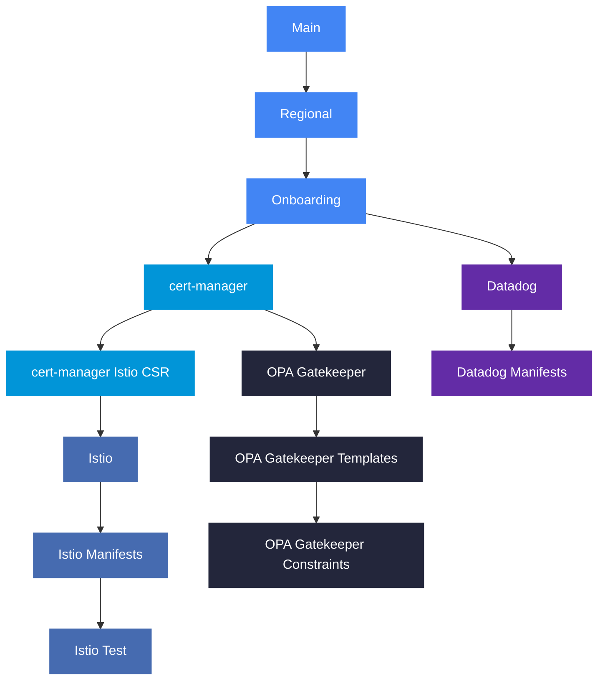

# Pneuma

 

## 📄 Repository Description

This repository contains the Infrastructure as Code (IaC) that shapes the Pneuma domain — the breathing, dynamic layer of the platform where structure comes alive. In the wider hierarchy of the Platform Team, Pneuma serves as the stratum where Corpus projects and networking become animated workload environments capable of receiving and running application teams.

Here, Kubernetes clusters are called into being across multiple zones; certificate management, service mesh, and policy enforcement are woven into each cluster; and Datadog observability extends its reach into the runtime so the platform can perceive and regulate itself at the application layer.

The Pneuma layer is where infrastructure breathes — where the static order established by Logos and the tangible form given by Corpus are joined by living workloads, dynamic routing, and continuous delivery. It is the atmosphere within which application teams move, build, and ship.

### 🛠️ Tools

- [pre-commit](https://github.com/pre-commit/pre-commit)
- [osinfra-pre-commit-hooks](https://github.com/osinfra-io/pt-techne-pre-commit-hooks)

### 📋 Skills and Knowledge

Links to documentation and other resources required to develop and iterate in this repository successfully.

- [cert-manager](https://cert-manager.io/docs/)
- [datadog kubernetes monitoring](https://docs.datadoghq.com/containers/kubernetes/)
- [datadog synthetics](https://docs.datadoghq.com/synthetics/)
- [google kubernetes engine](https://cloud.google.com/kubernetes-engine/docs)
- [istio service mesh](https://istio.io/latest/docs/)
- [kubernetes](https://kubernetes.io/docs/home/)
- [opa gatekeeper](https://open-policy-agent.github.io/gatekeeper/website/docs/)

## 🔄 Deployment Dependency Graph

Each workflow (sandbox, non-production, production) deploys a `main` workspace first, then runs the per-zone job chains in parallel across all 6 zones. The diagram below shows the dependency chain for one zone — the same pattern repeats for each zone.

