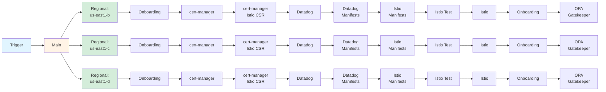

# pt-pneuma

Kubernetes/GKE infrastructure and cluster management layer.

## Architecture

**Main Deployment** (`main.tofu`):

- Creates Google Cloud projects per environment (sandbox, non-production, production) for Kubernetes workloads
- Integrates with Datadog for monitoring
- Consumes team and folder data from pt-logos via helpers module
- Uses GitHub Actions infrastructure (service accounts, workload identity, state storage) from pt-corpus

**Regional Deployment** (`regional/`):

- Creates GKE clusters in zones across multiple regions (us-east1-a/b/c, us-east4-a/b/c)
- Consumes project information from pt-pneuma main workspace via remote state
- Consumes networking (VPC, subnets) from pt-corpus projects
- Aggregates GKE cluster configurations from all teams via pt-logos

**Regional Subdirectories** (deployed after cluster creation):

- `cert-manager/` - Certificate management using cert-manager
- `datadog/` - Datadog operator for cluster monitoring and APM
- `istio/` - Service mesh with Istio for traffic management and observability
- `onboarding/` - Namespace and workload identity onboarding for applications
- `opa-gatekeeper/` - Policy enforcement using Open Policy Agent Gatekeeper

## GitHub Actions Workflow

**Workflow Details:**

- **Three Workflows**: Sandbox, Non-Production, Production (identical job structure)
- **Total Jobs**: 73 (1 Main + 72 regional zone jobs across 6 zones)
- **Zones**: us-east1-b, us-east1-c, us-east1-d, us-east4-a, us-east4-b, us-east4-c (diagram shows 3 for clarity)
- **Job Chain per Zone** (12 jobs): Regional → Onboarding → cert-manager → cert-manager Istio CSR → Datadog → Datadog Manifests → Istio Manifests → Istio Test → Istio → Onboarding → OPA Gatekeeper
- **Triggers**:
  - Sandbox: Pull request (opened, synchronize), excluding .md files
  - Non-Production: Push to main, excluding .md files
  - Production: Triggered when Non-Production workflow completes successfully
- **Job Dependencies**: All 6 regional jobs run in parallel after main, then each zone follows the same sequential chain
- **Called Workflow**: [osinfra-io/github-opentofu-gcp-called-workflows](https://github.com/osinfra-io/github-opentofu-gcp-called-workflows) (v0.2.9)

## Deployment Flow

1. **Main** → Creates Kubernetes project for environment (sandbox/non-production/production)
2. **Regional/Zonal** → Deploys GKE clusters in the project across multiple zones
3. **Regional Subdirectories** → Deploy cluster add-ons and configurations:
   - cert-manager → Certificate management
   - datadog → Monitoring and APM
   - istio → Service mesh
   - onboarding → Namespace and workload identity setup
   - opa-gatekeeper → Policy enforcement

## Separation of Concerns

- **pt-logos**: Foundational platform (teams, folders, identity groups, team configurations)
- **pt-corpus**: Networking infrastructure (VPC, subnets, DNS, NAT) in separate networking project
- **pt-pneuma**: Kubernetes infrastructure (projects) and GKE clusters (zonal deployments)
